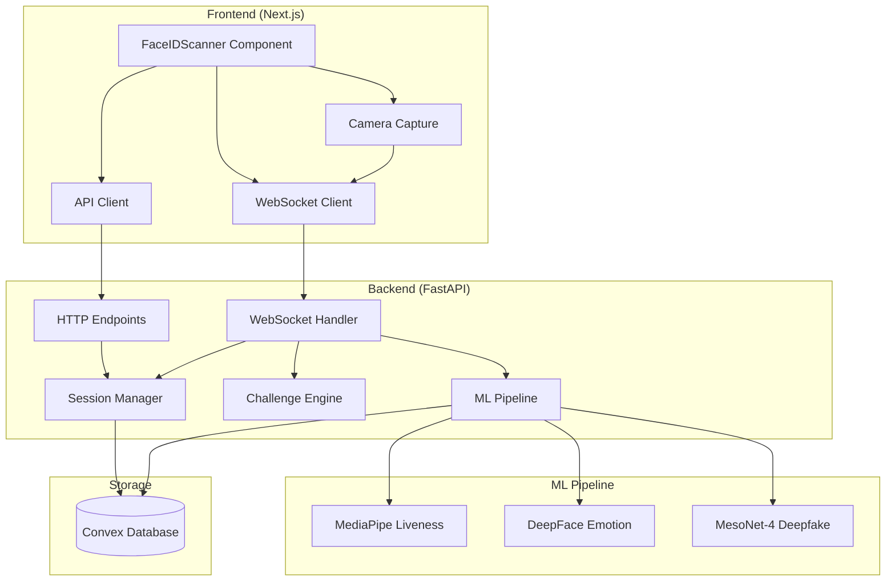
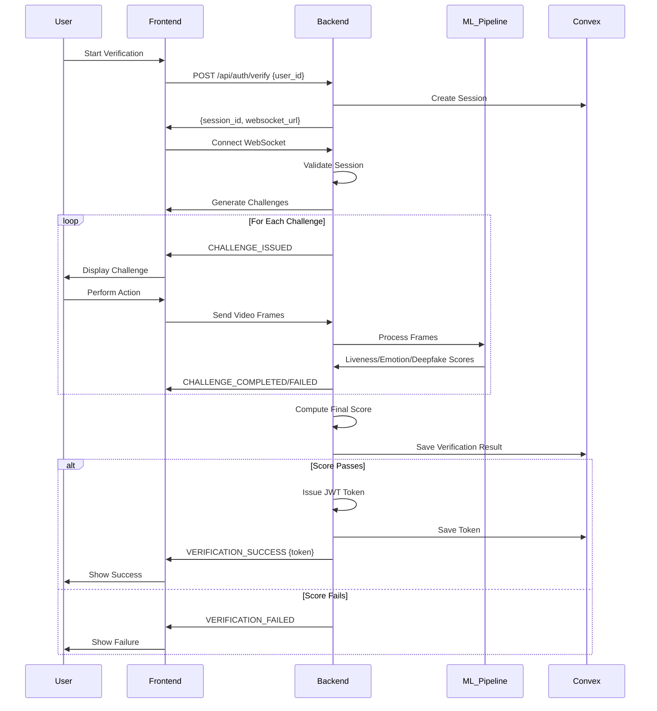

# Design Document: Backend-Frontend Integration

## Overview

This design document describes the integration architecture for connecting the FastAPI backend with the Next.js frontend in the Proof-of-Life Authentication System. The integration enables real-time biometric verification through WebSocket communication, allowing video frames to be transmitted from the client's camera to the server's ML pipeline, with immediate feedback returned to the user.

The system follows a client-server architecture where:
- The Frontend captures video frames and manages the user interface
- The Backend processes frames through ML models and orchestrates the verification flow
- Communication occurs via HTTP for session initialization and WebSocket for real-time verification
- Convex database stores session state, verification results, and audit logs

## Architecture

### High-Level Architecture



### Communication Flow



## Components and Interfaces

### Frontend Components

#### 1. API Client (src/lib/api.ts)

**Purpose:** Centralized HTTP client for backend communication

**Interface:**
```typescript
interface APIClient {
  // Create a new verification session
  createSession(userId: string): Promise<SessionResponse>;
  
  // Validate a JWT token
  validateToken(token: string): Promise<TokenValidationResponse>;
}

interface SessionResponse {
  session_id: string;
  websocket_url: string;
  message: string;
}

interface TokenValidationResponse {
  valid: boolean;
  user_id?: string;
  session_id?: string;
  issued_at?: number;
  expires_at?: number;
  error?: string;
}
```

**Implementation Details:**
- Uses fetch API for HTTP requests
- Reads base URL from `process.env.NEXT_PUBLIC_API_URL`
- Handles JSON serialization/deserialization
- Provides structured error handling with try-catch
- Returns typed responses using TypeScript interfaces

#### 2. WebSocket Client (integrated in verify-glass page)

**Purpose:** Real-time bidirectional communication with backend

**Interface:**
```typescript
interface WebSocketClient {
  // Connect to backend WebSocket
  connect(sessionId: string): void;
  
  // Send video frame to backend
  sendFrame(frameData: string): void;
  
  // Signal challenge completion
  signalChallengeComplete(): void;
  
  // Close connection
  disconnect(): void;
  
  // Event handlers
  onMessage(handler: (message: FeedbackMessage) => void): void;
  onError(handler: (error: Error) => void): void;
  onClose(handler: () => void): void;
}

interface FeedbackMessage {
  type: string;
  message: string;
  data?: any;
}
```

**Implementation Details:**
- Uses native WebSocket API
- Constructs URL from `process.env.NEXT_PUBLIC_WS_URL` and session_id
- Sends messages as JSON strings
- Parses incoming messages as JSON
- Implements reconnection logic (single retry)
- Cleans up connection on component unmount

#### 3. Camera Capture Module

**Purpose:** Capture video frames from user's camera

**Interface:**
```typescript
interface CameraCapture {
  // Request camera permissions and start capture
  start(): Promise<void>;
  
  // Stop capture and release camera
  stop(): void;
  
  // Capture current frame as base64
  captureFrame(): string;
  
  // Set frame capture rate (frames per second)
  setFrameRate(fps: number): void;
}
```

**Implementation Details:**
- Uses `navigator.mediaDevices.getUserMedia()` for camera access
- Renders video stream to hidden canvas element
- Captures frames using `canvas.toDataURL('image/jpeg', 0.8)`
- Implements frame rate limiting using `setInterval`
- Releases media stream on stop

#### 4. FaceIDScanner Component (src/components/FaceIDScanner.tsx)

**Purpose:** Visual UI for verification process

**Props:**
```typescript
interface FaceIDScannerProps {
  isScanning: boolean;
  progress: number;
  status: "idle" | "scanning" | "success" | "error";
  scores?: {
    liveness: number;
    emotion: number;
    deepfake: number;
  };
}
```

**Enhancements Needed:**
- Add `scores` prop to display real-time ML scores
- Update animations based on actual backend feedback
- Display current challenge instruction
- Show completed challenges count

#### 5. Verification Page (src/app/verify-glass/page.tsx)

**Purpose:** Orchestrate the entire verification flow

**State Management:**
```typescript
interface VerificationState {
  step: "idle" | "scanning" | "success" | "error";
  progress: number;
  currentChallenge: string;
  completedChallenges: number;
  totalChallenges: number;
  scores: {
    liveness: number;
    emotion: number;
    deepfake: number;
  };
  sessionId: string | null;
  token: string | null;
}
```

**Key Responsibilities:**
- Initialize session via API client
- Establish WebSocket connection
- Start camera capture
- Send frames at 10 FPS
- Handle incoming feedback messages
- Update UI state based on messages
- Store JWT token on success
- Clean up resources on unmount

### Backend Components

#### 1. HTTP Endpoints (backend/app/main.py)

**Existing Endpoints:**

**POST /api/auth/verify**
- Input: `{user_id: string}`
- Output: `{session_id: string, websocket_url: string, message: string}`
- Creates new session in Convex
- Logs session start in audit log
- Returns WebSocket URL for client connection

**POST /api/token/validate**
- Input: `{token: string}`
- Output: `{valid: boolean, user_id?: string, ...}`
- Validates JWT signature and expiration
- Returns token claims if valid

**GET /health**
- Output: `{status: string, services: {...}}`
- Health check for monitoring

#### 2. WebSocket Handler (backend/app/main.py)

**Endpoint:** `/ws/verify/{session_id}`

**Message Types Sent:**
- `CHALLENGE_ISSUED`: New challenge for user
- `CHALLENGE_COMPLETED`: Challenge passed
- `CHALLENGE_FAILED`: Challenge failed
- `SCORE_UPDATE`: ML scores computed
- `VERIFICATION_SUCCESS`: Final verification passed, includes token
- `VERIFICATION_FAILED`: Final verification failed
- `ERROR`: Error occurred

**Message Types Received:**
- `video_frame`: Contains base64-encoded frame
- `challenge_complete`: Client signals challenge done

**Flow:**
1. Accept WebSocket connection
2. Validate session_id exists and not timed out
3. Generate challenge sequence (3 challenges)
4. For each challenge:
   - Send CHALLENGE_ISSUED
   - Collect video frames (~20 frames per challenge)
   - Verify challenge using CV models
   - Send CHALLENGE_COMPLETED or CHALLENGE_FAILED
5. Run ML pipeline on all frames
6. Compute final score
7. If passed: issue JWT token, send VERIFICATION_SUCCESS
8. If failed: send VERIFICATION_FAILED
9. Close connection

#### 3. Frame Decoder

**Function:** `_decode_frame(frame_data: str) -> Optional[np.ndarray]`

**Purpose:** Convert base64 frame to numpy array

**Implementation:**
- Remove data URL prefix if present
- Decode base64 to bytes
- Convert bytes to numpy array
- Decode image using cv2.imdecode
- Return BGR image array

## Data Models

### Frontend Data Models

#### SessionResponse
```typescript
interface SessionResponse {
  session_id: string;
  websocket_url: string;
  message: string;
}
```

#### FeedbackMessage
```typescript
interface FeedbackMessage {
  type: "CHALLENGE_ISSUED" | "CHALLENGE_COMPLETED" | "CHALLENGE_FAILED" | 
        "SCORE_UPDATE" | "VERIFICATION_SUCCESS" | "VERIFICATION_FAILED" | "ERROR";
  message: string;
  data?: {
    // For CHALLENGE_ISSUED
    challenge_id?: string;
    instruction?: string;
    timeout_seconds?: number;
    
    // For CHALLENGE_COMPLETED
    confidence?: number;
    completed_count?: number;
    total_challenges?: number;
    
    // For SCORE_UPDATE
    liveness_score?: number;
    emotion_score?: number;
    deepfake_score?: number;
    
    // For VERIFICATION_SUCCESS
    token?: string;
    final_score?: number;
    expires_in_minutes?: number;
    
    // For VERIFICATION_FAILED
    threshold?: number;
    reason?: string;
  };
}
```

#### VideoFrameMessage
```typescript
interface VideoFrameMessage {
  type: "video_frame";
  frame: string; // base64-encoded JPEG
  timestamp?: number;
}
```

#### ChallengeCompleteMessage
```typescript
interface ChallengeCompleteMessage {
  type: "challenge_complete";
  challenge_id?: string;
}
```

### Backend Data Models

Backend already has well-defined data models in `app/models/data_models.py`:
- `VerificationFeedback`: Feedback messages sent to client
- `FeedbackType`: Enum of message types
- `ChallengeResult`: Result of challenge verification
- `ScoringResult`: Final verification scores
- `Session`: Session state

### Convex Schema

The Convex database already has schemas defined in `frontend/convex/`:
- `sessions`: Stores session state
- `verification_results`: Stores final scores and results
- `token_issuances`: Stores issued JWT tokens
- `audit_logs`: Stores all verification events
- `nonces`: Stores nonces for replay attack prevention

## Error Handling

### Frontend Error Handling

#### Camera Access Errors
```typescript
try {
  await cameraCapture.start();
} catch (error) {
  if (error.name === 'NotAllowedError') {
    // User denied camera permission
    showError("Camera access denied. Please allow camera access to continue.");
  } else if (error.name === 'NotFoundError') {
    // No camera found
    showError("No camera found. Please connect a camera to continue.");
  } else {
    // Other errors
    showError("Failed to access camera. Please try again.");
  }
}
```

#### WebSocket Connection Errors
```typescript
websocket.onerror = (error) => {
  console.error("WebSocket error:", error);
  setStep("error");
  showError("Connection error. Please check your internet connection.");
};

websocket.onclose = (event) => {
  if (event.code === 1008) {
    // Invalid session or security violation
    showError("Session invalid or expired. Please start a new verification.");
  } else if (event.code === 1011) {
    // Internal server error
    showError("Server error. Please try again later.");
  } else if (event.wasClean) {
    // Normal closure
    console.log("Connection closed normally");
  } else {
    // Abnormal closure - attempt reconnect
    if (!reconnectAttempted) {
      reconnectAttempted = true;
      setTimeout(() => connectWebSocket(sessionId), 2000);
    } else {
      showError("Connection lost. Please start a new verification.");
    }
  }
};
```

#### API Request Errors
```typescript
async function createSession(userId: string): Promise<SessionResponse> {
  try {
    const response = await fetch(`${API_URL}/api/auth/verify`, {
      method: 'POST',
      headers: { 'Content-Type': 'application/json' },
      body: JSON.stringify({ user_id: userId })
    });
    
    if (!response.ok) {
      const error = await response.json();
      throw new Error(error.error?.message || 'Failed to create session');
    }
    
    return await response.json();
  } catch (error) {
    console.error("Failed to create session:", error);
    throw error;
  }
}
```

### Backend Error Handling

Backend already implements comprehensive error handling:
- Global exception handler for unhandled exceptions
- HTTP exception handler for structured error responses
- WebSocket error handling with appropriate close codes
- Logging of all errors with stack traces

Error response format:
```json
{
  "error": {
    "code": "ERROR_CODE",
    "message": "Human-readable message",
    "category": "system|authentication|validation",
    "recoverable": true|false
  }
}
```

## Testing Strategy

### Unit Testing

#### Frontend Unit Tests
- **API Client Tests**: Mock fetch, test request/response handling
- **WebSocket Client Tests**: Mock WebSocket, test message sending/receiving
- **Camera Capture Tests**: Mock getUserMedia, test frame capture
- **Component Tests**: Test FaceIDScanner rendering with different props

#### Backend Unit Tests
Backend already has comprehensive unit tests. Integration tests should verify:
- Session creation endpoint
- Token validation endpoint
- Frame decoding function

### Property-Based Testing

Property-based tests will validate universal properties across all inputs. Each test will run a minimum of 100 iterations with randomized inputs.


## Correctness Properties

A property is a characteristic or behavior that should hold true across all valid executions of a system—essentially, a formal statement about what the system should do. Properties serve as the bridge between human-readable specifications and machine-verifiable correctness guarantees.

### Session Management Properties

Property 1: Session creation produces unique identifiers
*For any* user_id, calling the session creation endpoint should return a session_id that has not been previously issued in the current system state.
**Validates: Requirements 1.1**

Property 2: Session creation response structure
*For any* successful session creation request, the response should contain both "session_id" and "websocket_url" fields with non-empty string values.
**Validates: Requirements 1.2**

Property 3: Session persistence round-trip
*For any* session created via the API, querying Convex with the returned session_id should retrieve a session record containing the original user_id and a timestamp within 1 second of creation time.
**Validates: Requirements 1.3**

Property 4: Session audit logging
*For any* session created, there should exist an audit log entry with event_type "session_start", matching session_id, and timestamp within 1 second of session creation.
**Validates: Requirements 1.4**

### WebSocket Connection Properties

Property 5: WebSocket URL construction
*For any* session_id string, the WebSocket client should construct a URL matching the pattern `{WS_BASE_URL}/ws/verify/{session_id}` where WS_BASE_URL comes from environment configuration.
**Validates: Requirements 2.1**

Property 6: Session validation on connection
*For any* session_id that does not exist in Convex, attempting to establish a WebSocket connection should result in connection rejection with close code 1008. *For any* session_id that exists and is not timed out, the connection should be accepted.
**Validates: Requirements 2.2, 2.3**

Property 7: Timeout enforcement
*For any* session where (current_time - session.start_time) > SESSION_TIMEOUT_SECONDS, attempting to establish a WebSocket connection should result in connection rejection with close code 1008.
**Validates: Requirements 2.4, 2.5**

### Video Frame Transmission Properties

Property 8: Frame capture rate consistency
*For any* active camera capture session, the time interval between consecutive frame captures should be approximately 100ms ± 20ms (corresponding to 10 FPS ± 2 FPS).
**Validates: Requirements 3.2**

Property 9: Frame encoding validity
*For any* captured video frame, the encoded output should be a valid base64 string that can be decoded back to image data.
**Validates: Requirements 3.3**

Property 10: Frame message structure
*For any* video frame sent to the backend, the message should have type "video_frame" and contain a "frame" field with base64-encoded image data.
**Validates: Requirements 3.4, 13.2**

Property 11: Frame decoding round-trip
*For any* valid image encoded as base64, sending it through the encode-transmit-decode pipeline should produce a numpy array with the same dimensions and similar pixel values (allowing for JPEG compression artifacts).
**Validates: Requirements 3.5**

### Challenge Flow Properties

Property 12: Challenge sequence generation
*For any* WebSocket connection established with a valid session, the backend should generate and send exactly 3 challenge messages with type "CHALLENGE_ISSUED".
**Validates: Requirements 4.1, 4.2**

Property 13: Challenge display
*For any* CHALLENGE_ISSUED message received by the frontend, the challenge instruction text should appear in the DOM within 100ms.
**Validates: Requirements 4.3**

Property 14: Challenge feedback consistency
*For any* challenge that is successfully verified (confidence >= threshold), the backend should send a message with type "CHALLENGE_COMPLETED" containing a confidence score. *For any* challenge that fails verification (confidence < threshold), the backend should send a message with type "CHALLENGE_FAILED".
**Validates: Requirements 5.2, 5.3**

Property 15: Score update message structure
*For any* SCORE_UPDATE message sent by the backend, the message data should contain all three fields: "liveness_score", "emotion_score", and "deepfake_score", each with a numeric value between 0.0 and 1.0.
**Validates: Requirements 5.5, 6.1, 6.2, 6.3**

Property 16: Score display formatting
*For any* score value received (0.0 to 1.0), the displayed percentage should equal Math.round(score * 100).
**Validates: Requirements 6.4**

### Verification Completion Properties

Property 17: Final score computation
*For any* verification session where all challenges have been processed, a final_score should be computed and included in either a VERIFICATION_SUCCESS or VERIFICATION_FAILED message.
**Validates: Requirements 7.1**

Property 18: Success threshold enforcement
*For any* final_score >= threshold, the backend should send a "VERIFICATION_SUCCESS" message containing a valid JWT token. *For any* final_score < threshold, the backend should send a "VERIFICATION_FAILED" message without a token.
**Validates: Requirements 7.2, 7.3**

Property 19: Token persistence
*For any* JWT token received in a VERIFICATION_SUCCESS message, the token should be stored in Convex associated with the user_id and session_id, and should be retrievable via query.
**Validates: Requirements 7.4, 8.1, 8.2**

Property 20: UI state transitions
*For any* VERIFICATION_SUCCESS message received, the frontend status should transition to "success". *For any* VERIFICATION_FAILED message received, the frontend status should transition to "error".
**Validates: Requirements 7.5, 7.6**

### Error Handling Properties

Property 21: WebSocket error display
*For any* WebSocket error event or unexpected close event, the frontend should display an error message in the UI within 500ms.
**Validates: Requirements 9.1**

Property 22: Reconnection attempt limit
*For any* unexpected WebSocket disconnection during verification, exactly one reconnection attempt should be made. If reconnection fails, no further attempts should be made.
**Validates: Requirements 9.2, 9.3**

Property 23: Backend error message structure
*For any* error condition in the backend, the message sent should have type "ERROR" and contain a "message" field with error description.
**Validates: Requirements 9.4**

### Configuration Properties

Property 24: CORS origin validation
*For any* HTTP request from an origin listed in the CORS_ORIGINS environment variable, the response should include Access-Control-Allow-Origin header with that origin.
**Validates: Requirements 10.1, 10.5**

Property 25: Environment variable fallback
*For any* missing environment variable (NEXT_PUBLIC_API_URL, NEXT_PUBLIC_WS_URL, CORS_ORIGINS, CONVEX_URL), the system should use a default value appropriate for local development (localhost URLs).
**Validates: Requirements 11.5**

### Message Protocol Properties

Property 26: Frontend message type field
*For any* message sent by the frontend WebSocket client, the message should be valid JSON containing a "type" field with a string value.
**Validates: Requirements 13.1**

Property 27: Backend message structure
*For any* message sent by the backend WebSocket handler, the message should be valid JSON containing "type", "message", and "data" fields.
**Validates: Requirements 13.4**

Property 28: Backend message type enumeration
*For any* message sent by the backend, the "type" field value should be one of: "CHALLENGE_ISSUED", "CHALLENGE_COMPLETED", "CHALLENGE_FAILED", "SCORE_UPDATE", "VERIFICATION_SUCCESS", "VERIFICATION_FAILED", "ERROR".
**Validates: Requirements 13.5**

### Progress Tracking Properties

Property 29: Challenge completion counter
*For any* CHALLENGE_COMPLETED message received, the completed_challenges counter should increment by exactly 1.
**Validates: Requirements 14.1**

Property 30: Progress percentage calculation
*For any* state where completed_challenges = N and total_challenges = T, the displayed progress percentage should equal (N / T) * 100.
**Validates: Requirements 14.3, 14.4**

### Resource Cleanup Properties

Property 31: WebSocket cleanup on unmount
*For any* component unmount event, if a WebSocket connection is open, the close() method should be called on the WebSocket instance.
**Validates: Requirements 15.1**

Property 32: Camera resource cleanup
*For any* WebSocket close event, if camera capture is active, all media stream tracks should be stopped and the stream should be released.
**Validates: Requirements 15.2**

Property 33: Graceful connection closure
*For any* successful verification completion, the backend should close the WebSocket connection with code 1000. *For any* error condition, the backend should close with a non-1000 code (1008 for invalid session, 1011 for internal error).
**Validates: Requirements 15.3, 15.4**

